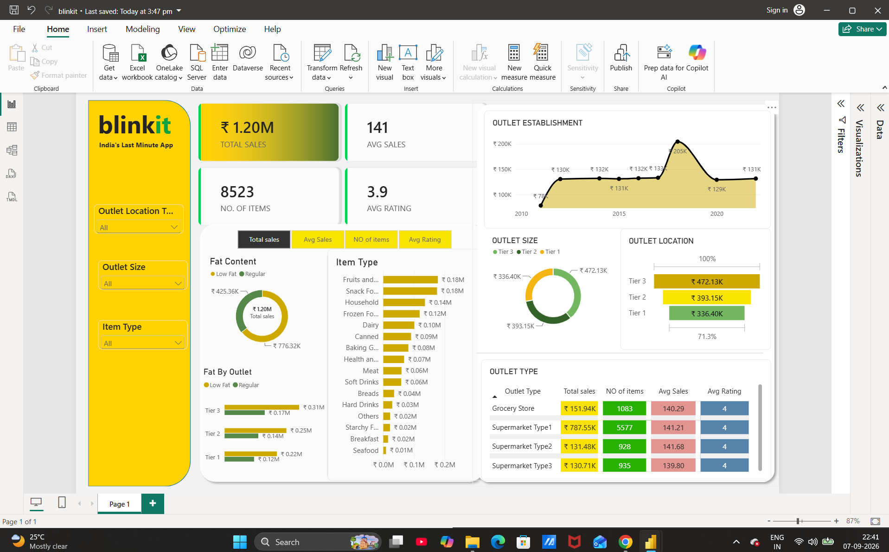

# blinkit-grocery-sales-analytics
An interactive Power BI dashboard tracking FMCG retail sales, item distributions, and outlet performance metrics (₹1.20M in revenue) across 8,523 products.

# Blinkit Grocery Delivery Analysis (Power BI + Excel)

An enterprise-ready Power BI dashboard tracking FMCG retail sales, item distributions, and outlet performance metrics across 8,523 products. This repository showcases a complete business intelligence solution—from raw Excel data ingestion to advanced DAX data modeling and modern executive UI/UX design.

##  Live Dashboard Preview


---

##  Key Features & Business Insights Delivered

*   **Executive Performance Dashboard:** Live tracking of **Total Sales (₹1.20M)**, **Average Sales (141)**, **Total Items Sold (8,523)**, and **Average Customer Rating (3.9)** .
*   **Granular Product Segmentation:** Analysis of sales by fat content (Low Fat vs. Regular) and item categories (such as Fruits, Vegetables, and Snack Foods) .
*   **Logistics & Outlet Auditing:** Deep-dive analysis of outlet performance broken down by **Location Tier** (Tier 1, 2, and 3), **Establishment Year**, and **Outlet Type** (Supermarket vs. Grocery Store) .
*   **Dynamic Column Swapping:** Utilizes a custom DAX **Field Parameter** table (`metrics`) to allow executives to dynamically swap the entire metric view of charts with a single click.

---

##  Relational Data Model
*   **Fact Table:** `BlinkIT Grocery Data`
*   **Data Source:** Excel/CSV Ingestion (`BlinkIT Grocery Data.xlsx`)
*   **Localization:** Fully formatted in Indian Rupee (₹) and decimal rounded for clean executive reporting.

---

##  DAX Formulas Library (Engineered Metrics)

Here is the advanced DAX logic designed and implemented for this dashboard:

### 1. Total Sales
```dax
Total sales = SUM('BlinkIT Grocery Data'[Sales])
2. Average Sales
Avg Sales = AVERAGE('BlinkIT Grocery Data'[Sales])
3. Number of Items Sold
NO of items = COUNTROWS('BlinkIT Grocery Data')
4. Average Rating
Avg Rating = AVERAGE('BlinkIT Grocery Data'[Rating])
5. Low Fat Sales Segment
Low Fat Sales = 
CALCULATE(
    [Total sales], 
    'BlinkIT Grocery Data'[Item Fat Content] = "Low Fat"
)
6. Regular Fat Sales Segment
Regular Fat Sales = 
CALCULATE(
    [Total sales], 
    'BlinkIT Grocery Data'[Item Fat Content] = "Regular"
)
7. Item Sales % of Total (All-Filter Override)
Item Sales % of Total = 
DIVIDE(
    [Total sales], 
    CALCULATE([Total sales], ALL('BlinkIT Grocery Data'[Item Type])), 
    0
)
8. Dynamic Metrics Selection (Field Parameter Table)
metrics = {
    ("Total sales", NAMEOF('BlinkIT Grocery Data'[Total sales]), 0),
    ("Avg Sales", NAMEOF('BlinkIT Grocery Data'[Avg Sales]), 1),
    ("NO of items", NAMEOF('BlinkIT Grocery Data'[NO of items]), 2),
    ("Avg Rating", NAMEOF('BlinkIT Grocery Data'[Avg Rating]), 3),
    ("Item Sales % of Total", NAMEOF('BlinkIT Grocery Data'[Item Sales % of Total]), 4),
    ("Low Fat Sales", NAMEOF('BlinkIT Grocery Data'[Low Fat Sales]), 5),
    ("Regular Fat Sales", NAMEOF('BlinkIT Grocery Data'[Regular Fat Sales]), 6)
}
Step 2: Expand Your Dynamic Field Parameter Table (metrics)
Using Power BI's modern field parameter table syntax, you can add these newly created calculations as selectable columns.
Replace your existing metrics table expression with this fully loaded version:
metrics = {
    ("Total sales", NAMEOF('BlinkIT Grocery Data'[Total sales]), 0),
    ("Avg Sales", NAMEOF('BlinkIT Grocery Data'[Avg Sales]), 1),
    ("NO of items", NAMEOF('BlinkIT Grocery Data'[NO of items]), 2),
    ("Avg Rating", NAMEOF('BlinkIT Grocery Data'[Avg Rating]), 3),
    ("Item Sales % of Total", NAMEOF('BlinkIT Grocery Data'[Item Sales % of Total]), 4),
    ("Low Fat Sales", NAMEOF('BlinkIT Grocery Data'[Low Fat Sales]), 5),
    ("Regular Fat Sales", NAMEOF('BlinkIT Grocery Data'[Regular Fat Sales]), 6)
}
Step 3: Format Your Measures for Professional UX
To make sure your numbers display beautifully across your dashboard card visuals and matrix tables
, highlight each measure in your Data pane and apply these standard formats using the Measure tools ribbon at the top of your screen:
Total sales, Low Fat Sales, and Regular Fat Sales: Format as Currency (₹) with 0 or 2 decimal places
.
Avg Sales: Format as a Decimal Number (or Whole Number)
.
NO of items: Format as a Whole Number
.
Avg Rating: Format as a Decimal Number with 1 decimal place
.
Item Sales % of Total: Format as a Percentage (%) with 2 decimal places.
How to use this dynamic metrics field on your report canvas 🎛️
Create a Slicer: Drag the metrics field you created in Step 2 directly onto an empty spot on your canvas and set the slicer style to Tile (or the new Button Slicer).
Configure Your Visuals: Take your Outlet Type matrix table
 and drag this metrics field into the Columns or Values bucket instead of hardcoding single metrics.
Watch the Magic Work: Now, when an executive clicks "Total sales" on your slicer, your table will dynamically change its columns to show sales
. If they click "Item Sales % of Total" or "Avg Rating", the entire table dynamically swaps to show those calculations instantly!
